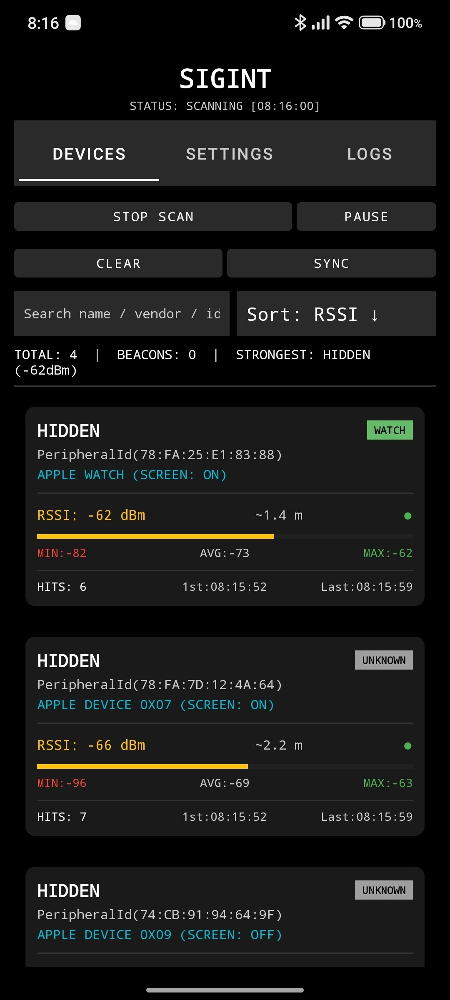
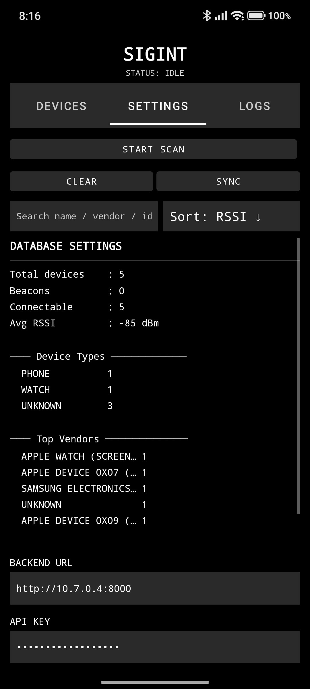

<p align=center>
    
    <h1 align=center>SIGINT Android</h1>
</p>

## SIGINT Android is an Android application for scanning and logging Bluetooth devices. It is designed for analyzing Bluetooth environments.

> This project is part of the SIGINT project, you can check it [here](https://github.com/dest4590/SIGINT)

### Features

- Scans for nearby Bluetooth devices and logs their information.
- Provides a user-friendly interface for viewing and managing scanned devices.

### Permissions

The application requires the following permissions to function correctly:

- `BLUETOOTH`, `BLUETOOTH_ADMIN`, `BLUETOOTH_SCAN`, `BLUETOOTH_ADVERTISE`, `BLUETOOTH_CONNECT`
- `ACCESS_FINE_LOCATION`, `ACCESS_COARSE_LOCATION`
- `POST_NOTIFICATIONS`
- `INTERNET`
- `WRITE_EXTERNAL_STORAGE`, `READ_EXTERNAL_STORAGE` (for older Android versions)

### Screenshots




### Building the Android App

1. Ensure you have the Android SDK and NDK installed.
2. Build the Rust library using `cargo-ndk` (see the [main repository](https://github.com/dest4590/SIGINT) for instructions).
3. Open this project in Android Studio or use Gradle to build:
    ```bash
    ./gradlew assembleDebug
    ```
